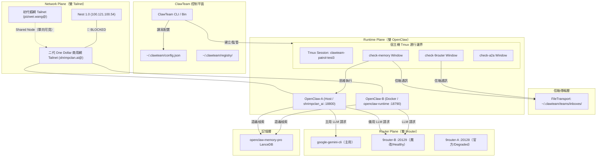

# Control Boundary Report: 控制平面與代理拓樸說明

本文件解析 Nest 2.0 上 ClawTeam 的**控制平面 (Control Plane)** 與**代理人拓樸 (Agent Topology)**，釐清各組件的邊界與通訊機制，為多代理系統提供架構藍圖。

---

## 1. 系統拓樸架構圖 (System Topology)

> **[B2a 註]** 本圖已於 2026-05-27 重基線，從單 OpenClaw / 單 9router 拓樸升級為三雙（雙 OpenClaw × 雙 9router × 雙 Tailnet）架構。B1 時期的原始單一拓樸圖已被此版取代。

---

## 2. 核心控制平面組件 (Control Plane Components)

* **ClawTeam CLI (`clawteam`)**：負責多代理的統籌與排程，包含團隊生成 (`spawn-team`)、代理生命週期生成 (`spawn`/`launch`)、工作區 Git Worktree 掛載、Kanban 看板變更 (`task update`) 與通訊信箱監聽 (`inbox watch`)。
* **狀態註冊表 (State Registry)**：
  * 所有團隊狀態、成員身分認證 (Agent Identity) 與任務資訊，皆以 JSON 格式持久化儲存於 `/home/shrimpclan_ai/.clawteam/` 下，實現無資料庫的極簡控制面。

---

## 3. 運行邊界與安全隔離 (Runtime & Isolation Boundaries)

* **Tmux 隔離邊界**：
  * **概念**：當前系統採用 `tmux` 做為流程 Jailer/Spawner。每個代理都被裝載在同一個 `clawteam-{team_name}` 會話的獨立 window 內。
  * **優勢**：
    1. **輸出持久化**：即使控制 SSH 中斷，代理的標準輸出與錯誤日誌依然留存在 tmux 面板中，隨時可透過 `tmux capture-pane` 進行遠端審計。
    2. **生命週期控制**：代理退出時會自動觸發退出鉤子 (`on-exit`)，通知控制平面回收資源並處理未完任務。
* **Docker 容器隔離邊界**（B2a 新增）：
  * **概念**：Nest 2.0 同時運行兩個 OpenClaw 實例——宿主機版與 Docker 容器版，形成雙控制面共存架構。
  * **OpenClaw-A（宿主機）**：`shrimpclan_ai` 用戶空間，systemd user service，gateway port `:18800`，core port `:18789`。負責 ClawTeam 主團隊的 A2A 協調。
  * **OpenClaw-B（Docker 容器）**：容器 `openclaw-runtime`，gateway port `:18790`（host-mapped from container `:18789`）。用於獨立任務執行，與宿主機共用 Tailscale IP 但各自佔用不同 port。
  * **隔離邊界差異**：容器內代理無法直接存取宿主機 tmux session，需透過 `docker exec` 進行跨界操作；網路命名空間可繼承宿主機 Tailscale IP 或使用 Docker bridge。
* **工作區隔離邊界 (Workspace Git Worktree)**：
  * 當啟動 `--workspace` 參數時，ClawTeam 會在主 Git 倉庫中動態創建專屬該代理的 `git worktree` 分支。代理在此目錄下的任何代碼修改，皆不會干擾其他代理或主分支，並可於任務完成後透過控制面自動進行 `checkpoint` 提交與安全合併。

---

## 4. 模型與通訊拓樸 (Model & Communication Channels)

* **信箱傳輸機制 (FileTransport Mailbox)**：
  * 代理與代理之間（A2A）或代理與隊長之間，不直接進行 socket 連接。
  * 通訊基於 `/home/shrimpclan_ai/.clawteam/teams/{team}/inboxes/{agent_name}` 的檔案目錄寫入。透過寫入特有的 JSON 訊息結構，代理可使用 `inbox send` 或 `inbox watch` 實現高效、解耦的異步消息傳遞。
* **模型調用路由 (Model Gateways)**（B2a 三通道重基線）：
  * **主渠道**：`google-gemini-cli` 透過 GCP ADC 憑證直接調用 Gemini 3 Flash Preview，繞過複雜代理。
  * **備援渠道（Healthy）**：`9router-B` 本地端口 `:20129`（蝦家班魔改版 / systemd user 管理），具備 SHRIMP-HAMMER-9 增強能力（`claw-config`、`claw-radar`、`claw-vault`），gemini-cli token 自動刷新。狀態 **healthy**。
  * **過時渠道（Degraded）**：`9router-A` 本地端口 `:20128`（官方 Release / root PM2 管理），codex token 認證。3 組 codex 帳號已於 2026-05-21 過期，狀態 **degraded**，僅存檔保留。
  * **Vertex Proxy**：`:8080`，ADC 授權，用於特定 Vertex AI 模型存取。

---

## 5. Network Plane 與 Shared Node 治理規則（B2a 新增）

Nest 2.0 參與兩個 Tailscale 網路，以 Shared Node 機制跨網可見：

* **主 Tailnet**：`shrimpclan.ai@`（二代 One Dollar 商用實驗網）。`shrimp-nexus-01` 為原生成員。
* **被 Share 給**：`piziwei.wang@`（初代蝦網）。Nest 2.0 以 Shared Node 方式向初代蝦網暴露。

### 四層可達性判定準則

| 層級 | 判定標準 | 跨 Tailnet 要求 |
|------|---------|---------------|
| **1. Visible（可見）** | DNS/IP 解析成功 | Shared Node 即可 |
| **2. Pingable（可 Ping）** | ICMP 層可達 | 需同網或雙向 Share |
| **3. SSH Reachable（可 SSH）** | 需原生節點身份或明確授權 | 需雙向 Share 或 VPN 穿透 |
| **4. HTTP/A2A Reachable（可 A2A）** | 完整 JSON-RPC 往返 | 需雙向 Share + 認證對齊 |

### 治理約束

* **可見 ≠ 可達**：Shared Node 僅提供第 1 層（Visible），不自動授予 2-4 層可達性。
* **反向 Share 要求**：除非初代蝦網中的目標主機也反向 share 給二代商用網，否則 Nest 2.0 不可將其視為可達目標。
* **Nest 1.0 現況**：`100.121.100.54` 標記為 🔴 **BLOCKED**，原因為 Shared Node 單向限制 — Nest 1.0 未反向 share 給二網。
* **禁止幻覺導航**：在世界地圖/代理調度中，禁止將 Shared Node「可見」誤判為「可達」，否則將產生導航失敗。
