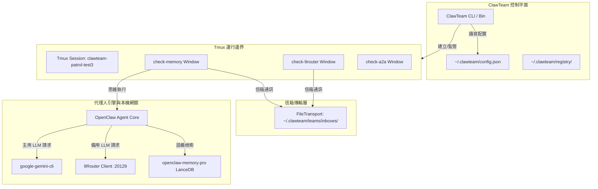

# Control Boundary Report: 控制平面與代理拓樸說明

本文件解析 Nest 2.0 上 ClawTeam 的**控制平面 (Control Plane)** 與**代理人拓樸 (Agent Topology)**，釐清各組件的邊界與通訊機制，為多代理系統提供架構藍圖。

---

## 1. 系統拓樸架構圖 (System Topology)

---

## 2. 核心控制平面組件 (Control Plane Components)

* **ClawTeam CLI (`clawteam`)**：負責多代理的統籌與排程，包含團隊生成 (`spawn-team`)、代理生命週期生成 (`spawn`/`launch`)、工作區 Git Worktree 掛載、Kanban 看板變更 (`task update`) 與通訊信箱監聽 (`inbox watch`)。
* **狀態註冊表 (State Registry)**：
  * 所有團隊狀態、成員身分認證 (Agent Identity) 與任務資訊，皆以 JSON 格式持久化儲存於 `/home/shrimpclan_ai/.clawteam/` 下，實現無資料庫的極簡控制面。

---

## 3. 運行邊界與安全隔離 (Runtime & Isolation Boundaries)

* **Tmux 隔離邊界**：
  * **概念**：當前系統採用 `tmux` 做為流程 Jailer/Spawner。每個代理都被裝載在同一個 `clawteam-{team_name}` 會話的獨立 window 內。
  * **優勢**：
    1. **輸出持久化**：即使控制 SSH 中斷，代理的標準輸出與錯誤日誌依然留存在 tmux 面板中，隨時可透過 `tmux capture-pane` 進行遠端審計。
    2. **生命週期控制**：代理退出時會自動觸發退出鉤子 (`on-exit`)，通知控制平面回收資源並處理未完任務。
* **工作區隔離邊界 (Workspace Git Worktree)**：
  * 當啟動 `--workspace` 參數時，ClawTeam 會在主 Git 倉庫中動態創建專屬該代理的 `git worktree` 分支。代理在此目錄下的任何代碼修改，皆不會干擾其他代理或主分支，並可於任務完成後透過控制面自動進行 `checkpoint` 提交與安全合併。

---

## 4. 模型與通訊拓樸 (Model & Communication Channels)

* **信箱傳輸機制 (FileTransport Mailbox)**：
  * 代理與代理之間（A2A）或代理與隊長之間，不直接進行 socket 連接。
  * 通訊基於 `/home/shrimpclan_ai/.clawteam/teams/{team}/inboxes/{agent_name}` 的檔案目錄寫入。透過寫入特有的 JSON 訊息結構，代理可使用 `inbox send` 或 `inbox watch` 實現高效、解耦的異步消息傳遞。
* **模型調用路由 (Model Gateways)**：
  * **主渠道**：`google-gemini-cli` 透過本機憑證直接向 Google Cloud Code Assist 節點通訊，繞過複雜代理。
  * **備用渠道**：`9router` 本地端口監聽 (`127.0.0.1:20129`)，於主渠道發生頻率限制時做為降級緩衝，確保系統高可用。
